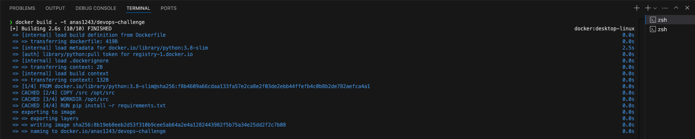
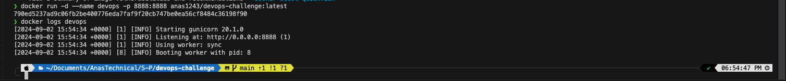
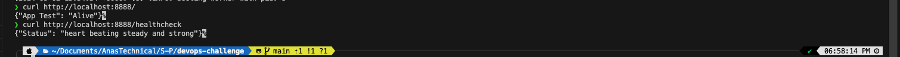
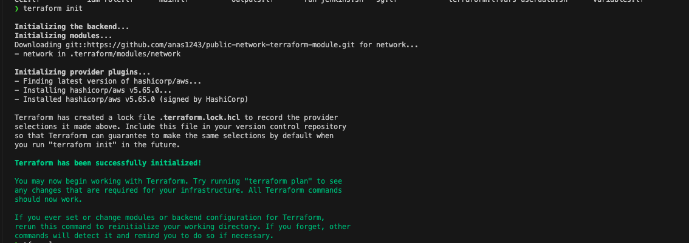
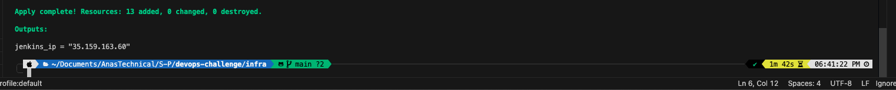
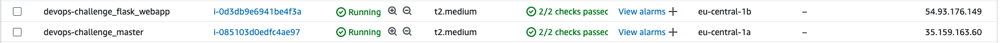
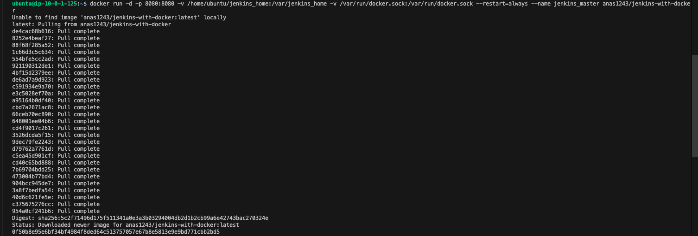
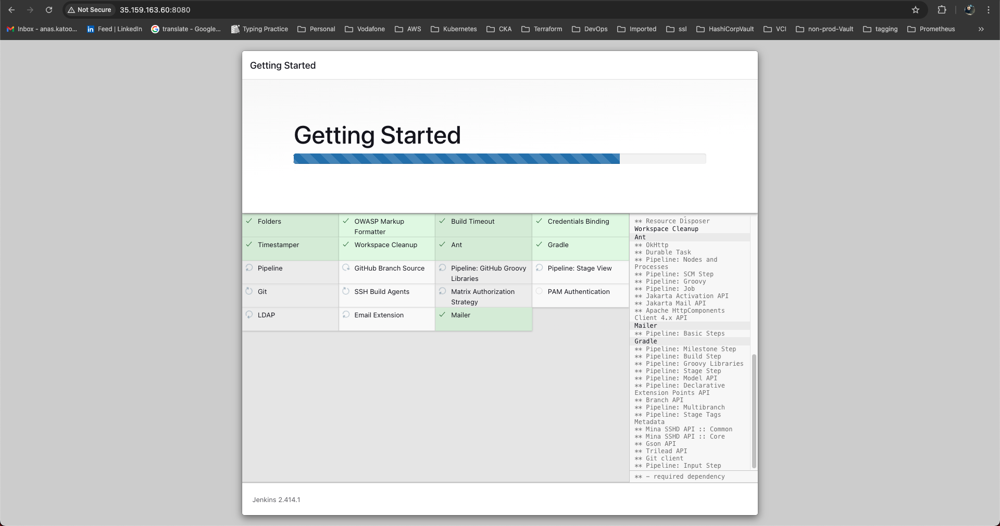
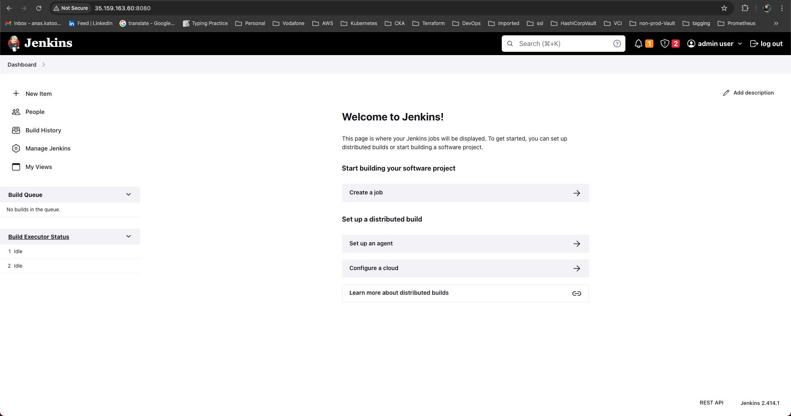

# Aim

This project is a hands-on lab to automate the deployment of a python webapp using AWS, Docker, Terraform, and Jenkins

## Local Test

1- Build the docker image

``` docker build . -t anas1243/devops-challenge ```



2- Run a Docker container from this image

``` docker run -d --name devops -p 8888:8888 anas1243/devops-challenge:latest ```




3- Test the deployment using Curl utility

``` curl http://localhost:8888/ ```

``` curl http://localhost:8888/healthcheck ```




## AWS Test

1- run Terraform to provision the infra

``` terraform init ```
``` terraform apply ```




2- see the infra in AWS



3- SSH to the Jenkins instance and run Jenkins

``` docker run -d -p 8080:8080 -v /home/ubuntu/jenkins_home:/var/jenkins_home -v /var/run/docker.sock:/var/run/docker.sock --restart=always --name jenkins_master anas1243/jenkins-with-docker ```





