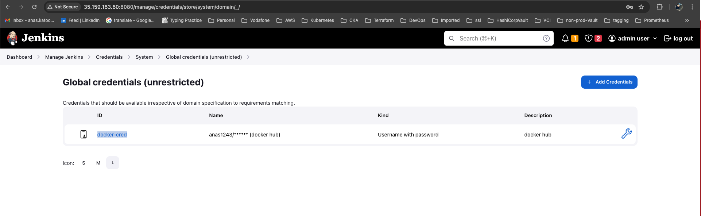
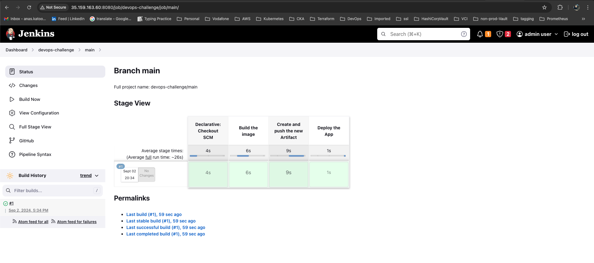
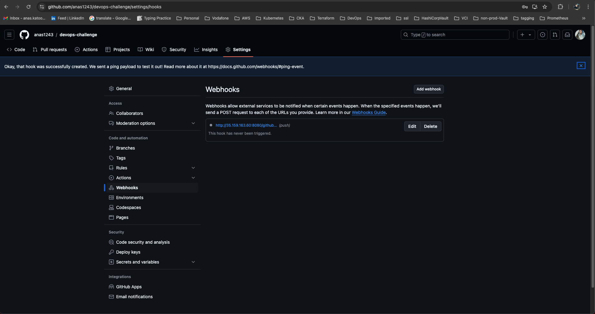
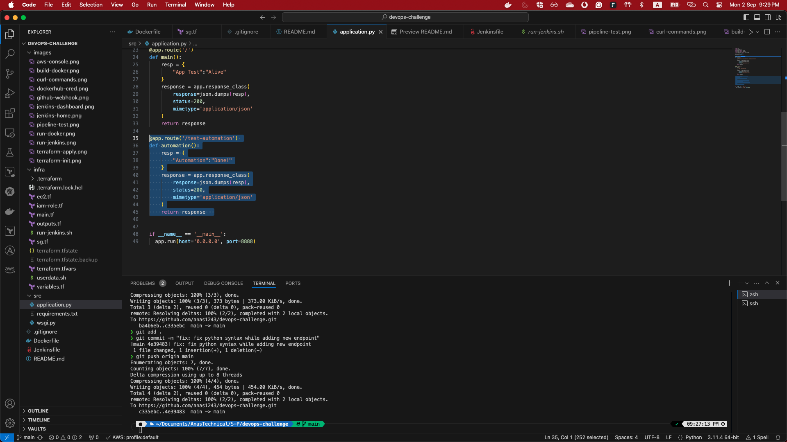
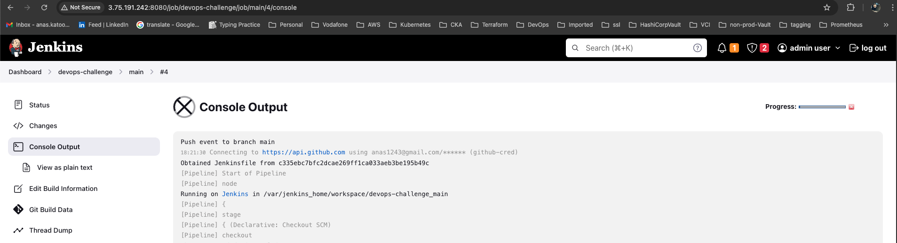
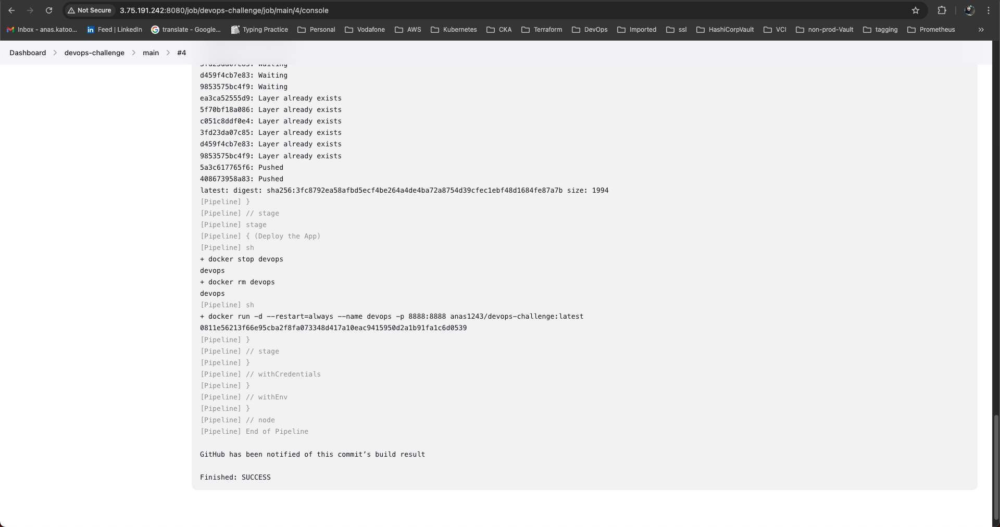
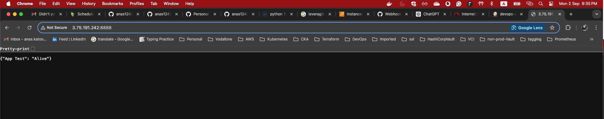
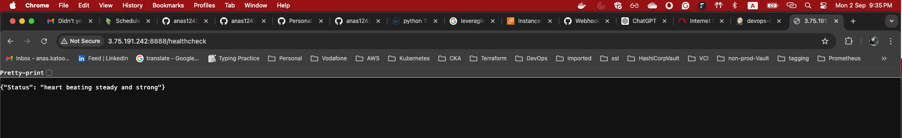
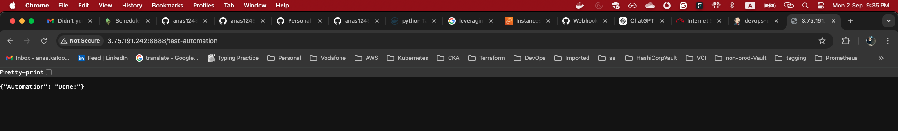

# Aim

This project is a hands-on lab to automate the deployment of a python webapp using AWS, Docker, Terraform, and Jenkins

## Local Deployment

1- Build the docker image

``` docker build . -t anas1243/devops-challenge ```


2- Run a Docker container from this image

``` docker run -d --name devops -p 8888:8888 anas1243/devops-challenge:latest ```


3- Test the deployment using Curl utility

``` curl http://localhost:8888/ ```

``` curl http://localhost:8888/healthcheck ```


## AWS Deployment

1- run Terraform to provision the infra

``` terraform init ```
``` terraform apply ```


2- see the infra in AWS


3- SSH to the Jenkins instance and run Jenkins

``` docker run -d -p 8080:8080 -v /home/ubuntu/jenkins_home:/var/jenkins_home -v /var/run/docker.sock:/var/run/docker.sock --restart=always --name jenkins_master anas1243/jenkins-with-docker ```


4- Add dockerhub credentials



5- Create, configure, and run the pipeline

I created a multi-branch pipeline in order to automate all env in the company. I created for now a jenkins file in the main branch that build, push, and deploy and code on the same instance



6- configure webhook to auto deploy the app

in the github repo we need to enable the webhook feature to push the new code version to the servers directly




7- make a change in the application to detect the triggering of the pipeline



** very important note **
can you see the commit hash is the same in my vscode and in jenkins. So it detected the correct push :wink:

after changing in the code and push these changes to github, jenkins should get an API call and the pipeline should be trigger  as shown below. 




after waiting the pipeline to finish it's work successfully, we need to test the three endpoint
A- /
B- /healthcheck
c- /test-automation



8- Test the webapp

now lets curl our APIs or simply use the browser






